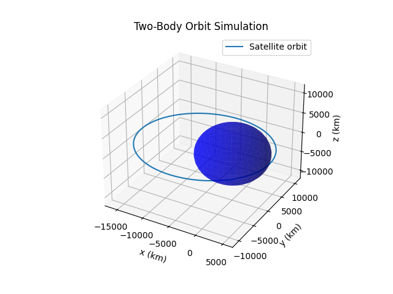

# Two-Body Orbital Mechanics Simulator

**Author:** Marwan Arabi

## Overview
A Python simulator for satellite orbits around Earth, built on the two-body problem — the same physics behind how the ISS and most real satellites move. Give it a starting position and velocity, and it numerically integrates Newton's gravity equation to work out the resulting orbit (circular or elliptical), then plots it in 3D next to a to-scale Earth.

## Background — The Two-Body Problem
For a satellite orbiting Earth (ignoring the Moon, Sun, and drag), Newton's law of gravitation gives its acceleration at any point:

```
a = -μ * r / |r|³
```

`r` is the satellite's position relative to Earth's centre, and `μ = GM` is Earth's gravitational parameter (398,600.4418 km³/s²).

That's a second-order equation, so it gets rewritten as a 6-element state vector `[x, y, z, vx, vy, vz]` and integrated numerically with `scipy.integrate.solve_ivp`.

## Features
- Simulates circular and elliptical orbits from any starting position/velocity
- Computes orbital period, periapsis, and apoapsis via the vis-viva equation
- Draws Earth to true scale in 3D, so an orbit that dips below the surface is obvious rather than hidden
- Equal-aspect-ratio plotting, so orbits aren't stretched or squashed on screen
- Standalone Hohmann transfer calculator (`hohmann_transfer.py`) — works out the delta-v for each burn and the transfer time between two circular orbits

## Example Result
Starting at 400 km altitude (roughly ISS altitude) at 1.2× circular speed gives an ellipse with periapsis ~400 km, apoapsis ~17,400 km, and a period of ~220 minutes:



## Requirements
- Python 3
- numpy
- scipy
- matplotlib

```
pip install numpy scipy matplotlib
```

## Usage
```
python orbit_sim_v1.py
```

For the Hohmann transfer calculator:
```
python hohmann_transfer.py
```

## Possible Extensions
- J2 perturbation (Earth's oblateness) for more realistic long-term propagation
- Ground track visualisation over a rotating Earth
